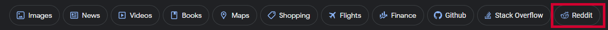

# Reddit on Google Search

A lightweight UserScript that adds a "Reddit" button to your Google Search results, allowing you to quickly filter searches to reddit.com.

---

## Features

- **Icon or Label** – Choose between displaying the official Reddit icon or the text label.
- **Flexible Positioning** – Insert the button at the start, end, or immediately after the "AI Mode" toggle in Google's navigation bar.
- **Persistent Settings** – Your preferences (display mode, position, wrapping) are saved automatically between browser sessions.
- **No-Wrap Mode** – Optionally prevent the navigation bar from wrapping when many buttons are present.
- **Easy Configuration** – Change settings on the fly via a menu command without editing the script.

---

## Installation on Windows

1. **Install a Userscript Manager**
   - **Chrome / Edge**: Install [Tampermonkey](https://tampermonkey.net/?ext=dhdg&browser=chrome).
   - **Firefox**: Install [Greasemonkey](https://addons.mozilla.org/firefox/addon/greasemonkey/).

2. **Add the Script**
   - Go to the GreasyFork page: https://greasyfork.org/en/scripts/462356-reddit-on-google-search
   - Click **Install** and confirm in the userscript manager popup.

3. **Enjoy**
   - Perform a Google search. The Reddit button will appear in the navigation bar.

---

## Usage

- **Filter Search**: Click the **Reddit** button to toggle `site:reddit.com` on your current query.
- **Auto-Reapply**: If you click again, it will remove the filter to return to standard search results.

---

## Configuration

Open the userscript menu (right-click the Tampermonkey/Greasemonkey icon) and select **⚙️ Configure Reddit Button…**. You will be prompted to adjust:

| Setting      | Options                    | Description                                      |
|--------------|----------------------------|--------------------------------------------------|
| **displayMode**  | `icon` or `label`          | Show the Reddit icon or the text label.          |
| **btnPosition**  | `start`, `end`, `afterai`  | Position of the button in the nav bar.           |
| **fixSize**      | `true` or `false`          | Prevent wrapping of the nav bar (no-wrap mode).  |

After saving, the page reloads to apply your new settings.

---

## License

This project is licensed under the [MIT License](https://opensource.org/licenses/MIT).

---

## Credits

- **Author**: [Alexyoe](https://github.com/Alexyoe)
- **Inspired by**: marioortizmanero’s [reddit-search-on-google](https://github.com/marioortizmanero/reddit-search-on-google)
